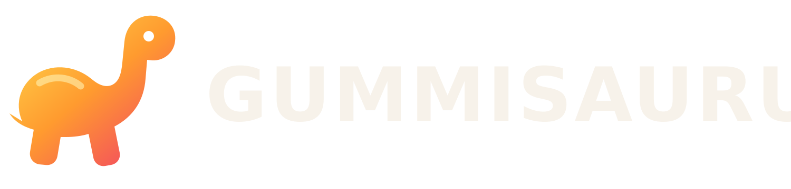

<p align="center">
  
</p>

# Gummisaurus

Gummisaurus is an independent, open source media client for Amazon Vega OS. It
connects to servers running [Jellyfin](https://jellyfin.org/) and is maintained
by Tallest Giant LLC.

This project is not affiliated with or endorsed by Jellyfin, Inc. or Amazon.
Jellyfin is a trademark of Jellyfin, Inc. Gummisaurus uses its own name and
visual identity in accordance with the Jellyfin branding policy.

## Status

Gummisaurus is in initial development and is not ready for general use. The
first milestone is a testable VPKG for Vega OS 1.2 based on Vega SDK 0.24.

## Architecture

The project forks `jellyfin-web` and packages its TV interface inside a native
React Native for Vega shell. This keeps broad Jellyfin server compatibility and
an upstream merge path while using Vega's WebView, hardware media stack, remote
input, and system media controls.

The inherited web client already includes TV navigation, Vega user-agent
detection, HLS playback, trickplay, media-segment actions for intros and
credits, and next-episode autoplay. Native Vega playback will replace WebView
playback only where device testing shows a concrete compatibility or
performance need.

## Repository Layout

- `src/`: the GPL-licensed web client fork
- `vega/`: the Vega SDK 0.24 application shell
- `webpack.vega.js`: builds the web client directly into the Vega package

## Build

Requirements:

- Node.js 24 and npm 11 for the web client
- Node.js 22 or newer for the Vega shell
- Vega SDK 0.24

```sh
npm ci
npm --prefix vega ci
npm run build:vega:debug
```

The VPKG is written under `vega/build/`. A production package can be built with
`npm run build:vega:release`.

## Compatibility Priorities

- User-supplied local HTTP and remote HTTPS servers
- Password and Quick Connect authentication
- Movie, television, music, and live TV libraries
- Direct play with reliable transcoding fallback
- Audio tracks, subtitles, trickplay, intro and credit segments
- Server-supplied pre-rolls and next-episode autoplay
- Optional media-request and access-gateway integrations

## Upstream

The `upstream` remote tracks
[`jellyfin/jellyfin-web`](https://github.com/jellyfin/jellyfin-web). Changes that
benefit the wider Jellyfin ecosystem should be kept suitable for upstreaming
where practical.

## License

Gummisaurus is distributed under the GNU General Public License version 2 or,
at your option, any later version. Existing Jellyfin copyright and attribution
notices remain intact. See [LICENSE](LICENSE).
